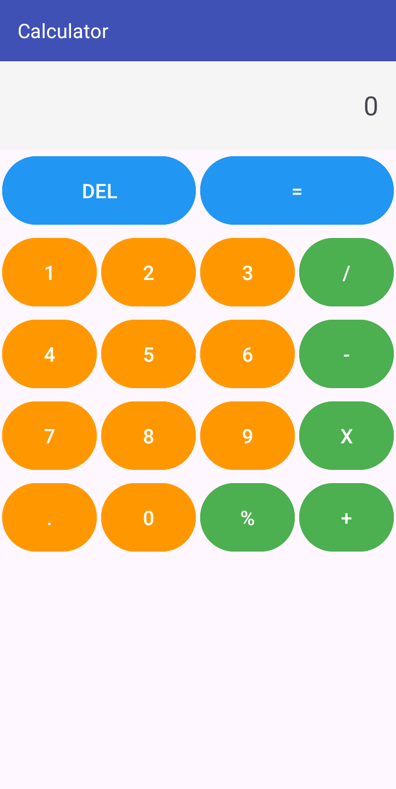

# Ứng dụng Máy tính (Calculator)

Một ứng dụng máy tính đơn giản nhưng đầy đủ chức năng cho Android, giúp người dùng thực hiện các phép tính cơ bản một cách nhanh chóng và chính xác.

## Mô tả

Ứng dụng "Calculator" được thiết kế với giao diện trực quan, thân thiện với người dùng, cho phép thực hiện các phép tính số học cơ bản như cộng, trừ, nhân, chia và phần trăm. Ứng dụng hỗ trợ cả số nguyên và số thập phân, với khả năng hiển thị kết quả chính xác.

## Tính năng chính

- Thực hiện các phép tính cơ bản: cộng (+), trừ (-), nhân (X), chia (/)
- Tính phần trăm (%) của một số
- Hỗ trợ số thập phân với dấu chấm (.)
- Xóa từng ký tự với nút DEL
- Hiển thị toán tử đang được sử dụng
- Xử lý các trường hợp đặc biệt như chia cho 0
- Định dạng số với dấu phân cách hàng nghìn và phần thập phân

## Hình ảnh minh họa

### Màn hình chính của ứng dụng

## Cấu trúc ứng dụng

Ứng dụng bao gồm một màn hình chính với các thành phần:

1. **Khu vực hiển thị**: Hiển thị toán tử và kết quả tính toán
2. **Bàn phím số**: Các nút số từ 0-9 và dấu thập phân
3. **Các phép toán**: Các nút cho các phép tính cơ bản
4. **Nút chức năng**: DEL để xóa và = để thực hiện phép tính

## Luồng hoạt động

1. Người dùng nhập số đầu tiên
2. Chọn phép tính (+, -, X, /)
3. Nhập số thứ hai
4. Nhấn = để hiển thị kết quả
5. Có thể tiếp tục tính toán với kết quả vừa có hoặc bắt đầu phép tính mới

## Xử lý trường hợp đặc biệt

- **Chia cho 0**: Hiển thị thông báo "Không thể chia cho 0"
- **Kết quả không hợp lệ**: Hiển thị "Lỗi phép tính"
- **Số âm**: Hỗ trợ nhập số âm bằng cách nhấn dấu trừ đầu tiên

## Yêu cầu hệ thống

- Android 14.0 (API level 34 - "UpsideDownCake")
- Android Studio

## Cách cài đặt

1. Clone repository này về máy local
2. Mở dự án bằng Android Studio
3. Sync Gradle và build project
4. Chạy ứng dụng trên thiết bị thật hoặc máy ảo

## Công nghệ sử dụng

- Java
- Android SDK
- TableLayout để tạo bàn phím máy tính
- DecimalFormat để định dạng số
- Xử lý sự kiện onClick

## Thiết kế giao diện

- Giao diện hiện đại với các nút có màu sắc phân biệt:
  - Nút số: Màu cam (#FF9800)
  - Nút toán tử: Màu xanh lá (#4CAF50)
  - Nút chức năng: Màu xanh dương (#2196F3)
- Khu vực hiển thị kết quả rõ ràng với nền màu xám nhạt
- Bố cục hợp lý, dễ sử dụng bằng một tay

## Giấy phép

Dự án được phân phối dưới giấy phép MIT. Xem file `LICENSE` để biết thêm chi tiết.

## Tác giả

© 2025 - Được phát triển bởi Eggpant203 🍆

---

_Lưu ý: Đây là ứng dụng máy tính đơn giản cho mục đích học tập. Mọi đóng góp và phản hồi đều được chào đón._
